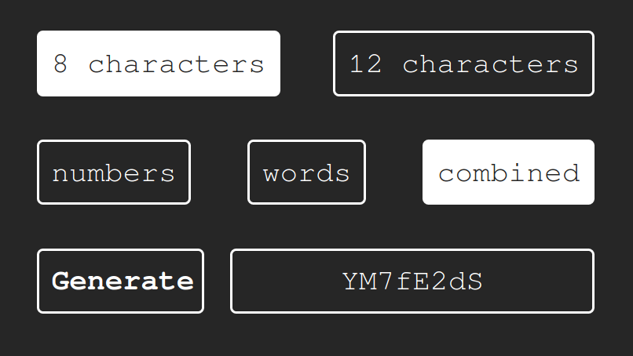

# Password-Generator
A minimalist app to create secure and standardized passwords :lock::key:

Select both **lenght** and **type** buttons and click on **Generate** to create a random password

<p align="center">
	
</p>

# Dictionary creator
Dictionary creator allows you to create standarized WPA Dictionaries.
You must run this from **Linux Terminal**. 
- On **Linux** :penguin: 	Use Terminal *Ctrl + Alt + T*
- On **Windows** :computer: 	Use WSL *Windows Subsystem for Linux*
- On **Mac** :apple: 	Use Terminal *Command + Space* and type Terminal

```sh
#Remember to add permissions on dictionaryCreator.sh
sudo chmod +rwx dictionaryCreator.sh
# To run the script
./dictionaryCreator.sh
```
