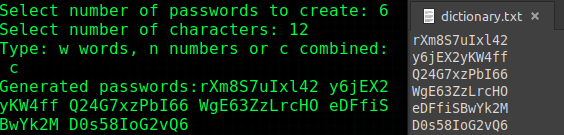

# Password-Generator
A minimalist JavaScript app to create secure and standardized passwords :lock::key:

Select both **lenght** and **type** buttons and click on **Generate** to create a random password

<p align="center">
	
</p>

# Dictionary Creator
Dictionary creator is a Bash script that allows you to create standarized WEP/WPA/WPA2 Dictionaries

This tool is also useful to generate dictionary files to crack passwords using wireless attack tools like *aircrack-ng* or *Fern wifi cracker*, both available on **Kali Linux** :dragon:

You must run this from the **Terminal**. 
- On **Linux** :penguin: 	Use Terminal *Ctrl + Alt + T*
- On **Windows** :computer: 	Use WSL *Windows Subsystem for Linux*
- On **Mac** :apple: 	Use Terminal *Command + Space* and type Terminal

```sh
#Remember to add permissions on dictionaryCreator.sh
sudo chmod +rwx dictionaryCreator.sh
# To run the script
./dictionaryCreator.sh
```
<p align="center">
	
</p>

